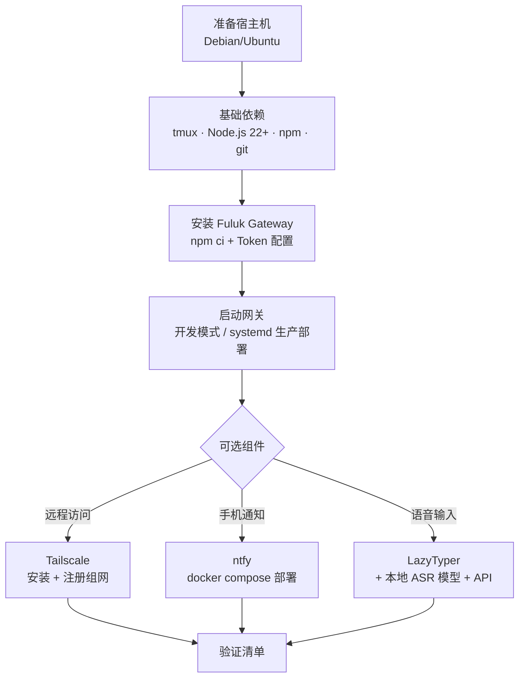

# Fuluk Gateway 安装指南

面向 Debian/Ubuntu 系 Linux 宿主机（网关本体）的完整安装说明，覆盖：


* **必需依赖**：`tmux`、Node.js 22+、npm，以及可选的后端 CLI（codex /claude/opencode /pi-os）

* **可选组件**：`Tailscale`（脱离局域网远程访问）、`ntfy`（手机 APP 通知）、`LazyTyper`（语音转写输入法）+ 本地 ASR 模型与 OpenAI 兼容 API

> 约定：
>
> `$`
>
>  表示普通用户命令，
>
> `#`
>
>  表示 root /sudo 命令。所有示例 IP（如 
>
> `192.168.0.55`
>
> ）均为占位，请替换为你的宿主机实际局域网 IP。

## 安装总览





***

## 1. 基础环境准备

### 1.1 系统更新与基础工具


```
sudo apt update && sudo apt upgrade -y

sudo apt install -y curl git ca-certificates build-essential
```

### 1.2 安装 tmux（必需）

网关通过 `tmux` 直接管理 `codex` / `claude` / `opencode` / `pi-os` 与 shell 会话，因此 `tmux` 是硬性依赖：


```
sudo apt install -y tmux

tmux -V   # 应输出 tmux 3.x
```

使用注意：


* 网关会话在独立的 tmux 窗口中运行，不要手动 `tmux kill-server` 或对网关会话窗口执行 kill，否则所有 AI 会话会一并中断；

* 查看现有会话：`tmux ls`；如需手动进入检查：`tmux attach -t <session>`（只读查看后按 `Ctrl-b d` 退出，不要关闭窗口）。

### 1.3 安装 Node.js 22+ 与 npm（必需）

推荐使用 NodeSource 官方源（Debian / Ubuntu）：


```
curl -fsSL https://deb.nodesource.com/setup\_22.x | sudo -E bash -

sudo apt install -y nodejs

node -v   # 应输出 v22.x

npm -v
```

> 备选：使用 
>
> [nvm](https://github.com/nvm-sh/nvm)
>
>  安装（
>
> `nvm install 22`
>
> ），适合需要多版本切换的场景。

### 1.4 可选：安装后端 AI CLI

网关管理的会话后端，按需安装（命令以各项目官方文档为准）：


| 后端       | 用途               | 安装方式（示例）                                   |
| -------- | ---------------- | ------------------------------------------ |
| codex    | OpenAI Codex CLI | `npm install -g @openai/codex` 或官方安装脚本     |
| claude   | Claude Code      | `npm install -g @anthropic-ai/claude-code` |
| opencode | OpenCode CLI     | `npm i -g opencode-ai` 或官方脚本               |
| pi-os    | Pi Agent OS      | 见 `@earendil-works/pi-agent-core` 官方文档     |

安装后确认命令可用（如 `codex --version`、`claude --version`），并在首次使用时完成各自的登录 / 鉴权。


***

## 2. 安装 Fuluk Gateway

### 2.1 拉取代码并安装依赖


```
sudo git clone https://github.com/springycloveting/fuluk /opt/fuluk-gateway

cd /opt/fuluk-gateway

sudo chown -R "\$(id -un):\$(id -gn)" /opt/fuluk-gateway   # 便于非 root 用户运行

npm ci
```

### 2.2 配置认证 Token（必需）

生成强随机 Token：


```
node -e "console.log(require('crypto').randomBytes(32).toString('hex'))"
```

`SESSION_GATEWAY_TOKEN` 为必填项，服务端没有内置默认 Token，缺失将拒绝启动。生产环境请勿使用示例值。

### 2.3 启动方式

**方式一：本地开发**


```
SESSION\_GATEWAY\_TOKEN=\<YOUR\_TOKEN> npm run dev
```

**方式二：生产部署（systemd，推荐）**


```
sudo SERVICE\_USER="\$(id -un)" SERVICE\_GROUP="\$(id -gn)" ./deploy/install-systemd.sh

sudo editor /etc/fuluk-gateway/fuluk-gateway.env   # 填入真实 SESSION\_GATEWAY\_TOKEN

sudo systemctl start fuluk-gateway
```

默认路径：应用 `/opt/fuluk-gateway`、环境文件 `/etc/fuluk-gateway/fuluk-gateway.env`、数据与数据库 `/var/lib/fuluk-gateway/`。

### 2.4 验证启动


```
curl http://127.0.0.1:8787/health          # 预期返回 ok/healthy

curl -H "Authorization: Bearer \<YOUR\_TOKEN>" http://127.0.0.1:8787/api/sessions
```

打开 `http://127.0.0.1:8787`，在 Config 对话框中填入相同 Token 即可开始使用。

### 2.5 配置助手功能（web-pi・LLM API 管理会话）

网关内置自然语言助手 web-pi（`/api/nl` 端点）：配置一个 LLM API 后，即可在 Web 界面直接用自然语言管理会话 —— 列出 / 统计会话、查看输出、发送指令、切换、停止、重启、新建 —— 无需记忆 REST 命令。解析流程为确定性规则优先（`src/nl.mjs`），规则无法命中时由 AI 助手回退并综合后端结果作答。

**配置入口**：Web 端「配置 → 助手」对话框，或直接写入运行时设置（`data/session-gateway-settings.json`，也可通过 `PUT /api/config` 写入）。

**示例一：本地 LLM（OpenAI 兼容，如 llama-server）**


```
{

&#x20; "sessionAgent": {

&#x20;   "enabled": true,

&#x20;   "model": "openai:gemma-4-E4B-it",

&#x20;   "models": {

&#x20;     "openai": {

&#x20;       "gemma-4-E4B-it": {

&#x20;         "api": "openai",

&#x20;         "baseUrl": "http://\<HOST\_IP>:8000/v1",

&#x20;         "apiKey": "local"

&#x20;       }

&#x20;     }

&#x20;   }

&#x20; }

}
```

**示例二：云端模型**


```
{

&#x20; "sessionAgent": {

&#x20;   "enabled": true,

&#x20;   "model": "openai:gpt-5.2",

&#x20;   "apiKey": "\<YOUR\_API\_KEY>"

&#x20; }

}
```

字段说明：


| 字段                                  | 说明                                                          |
| ----------------------------------- | ----------------------------------------------------------- |
| `enabled`                           | 是否启用助手（默认关）                                                 |
| `model`                             | `提供商:模型ID` 格式；内置提供商（如 `openai:gpt-5.2`）可直接使用                |
| `models.<Provider>.<ModelName>`     | 自定义模型条目（OpenAI 兼容端点在此注册）                                    |
| `...baseUrl`                        | OpenAI 兼容端点地址，如本地 llama-server 的 `http://<HOST_IP>:8000/v1` |
| `...api`                            | 接口类型，OpenAI 兼容填 `openai`                                    |
| `...apiKey`                         | API 密钥；本地无鉴权可填 `local` 或任意值                                 |
| `...contextWindow` / `...maxTokens` | 可选，默认 128000 / 4096                                         |
| `...reasoning` / `...headers`       | 可选，推理模型开关 / 额外请求头                                           |

> 本地模型时，
>
> `models`
>
>  中的模型名须与 llama-server 
>
> `/v1/models`
>
>  返回的名称一致（默认是 GGUF 文件名，也可用 
>
> `--alias`
>
>  指定别名）。
> 运行时设置只影响新建会话；已有会话保留创建时的命令。

**（可选）AI 命令解析回退 commandParser**：若不使用完整助手，仅想让规则解析失败时用本地模型做命令分类，可配置：


```
{

&#x20; "commandParser": {

&#x20;   "enabled": true,

&#x20;   "baseUrl": "http://\<HOST\_IP>:8000/v1",

&#x20;   "model": "gemma-4-E4B-it",

&#x20;   "apiKey": "local"

&#x20; }

}
```

（若 `sessionAgent.model` 已配置，会优先使用 sessionAgent，commandParser 可省略。）

**验证**：保存后，在 Web 界面输入「列出所有会话」「查看 codex-app 最近输出」「停止 sessions」等自然语言指令，助手应基于真实后端数据回复并执行对应操作。


***

## 3. ntfy 通知服务（可选・手机 APP 通知）

ntfy 是自托管的推送通知服务。Fuluk 手机 APP 内置前台服务直接订阅本地 ntfy，实现任务完成、眼镜配对确认等通知的实时推送。

### 3.1 安装 Docker（若尚未安装）


```
curl -fsSL https://get.docker.com | sudo sh

sudo usermod -aG docker "\$(id -un)"   # 重新登录后生效
```

### 3.2 部署项目自带 ntfy

仓库已内置配置（`deploy/ntfy/`），直接启动：


```
cd /opt/fuluk-gateway

docker compose -f deploy/ntfy/docker-compose.yml up -d

docker ps | grep fuluk-ntfy                      # 容器应为 Up 状态

curl http://\<HOST\_IP>:8099/v1/health             # 健康检查
```

> 首次部署请按实际主机 IP 修改两处：
> `deploy/ntfy/server.yml`
>
>  中的 
>
> `base-url: "http://<HOST_IP>:8099"`
> 下方配置中的服务器地址

常用运维命令：


```
docker compose -f deploy/ntfy/docker-compose.yml restart   # 重启

docker logs -f fuluk-ntfy                                  # 查看日志
```

### 3.3 网关侧配置

在 Web 端「配置 → 通知」填写，或直接写入运行时设置（`PUT /api/config` / `data/session-gateway-settings.json`）：


```
{

&#x20; "notifications": {

&#x20;   "ntfy": {

&#x20;     "server": "http://\<HOST\_IP>:8099",

&#x20;     "topic": "fuluk",

&#x20;     "token": "",

&#x20;     "enabled": true

&#x20;   }

&#x20; }

}
```

### 3.4 手机 APP


* Fuluk APP 设置页填写相同服务器与 Topic（内置前台服务订阅，无需安装 ntfy APP）；

* 也可以直接在手机上安装官方 ntfy APP 订阅同一 Topic。

### 3.5 测试通知


```
curl -H "Title: 测试" -d "hello from fuluk" http://\<HOST\_IP>:8099/fuluk
```

### 3.6 安全加固（局域网部署建议）

默认配置为开放读写（`auth-default-access: read-write`），同一网络内知道 Topic 的人即可订阅 / 发布。建议：


1. 使用不易猜测的 Topic 名（如 `fuluk-<随机串>`）；

2. 启用账号鉴权：在 `server.yml` 挂载 auth 文件并设置 `auth-file: /var/lib/ntfy/user.db`、`auth-default-access: "deny-all"`，然后：


```
docker exec fuluk-ntfy ntfy user add \<name>
```


1. 在 ntfy Web UI「Account」生成 `tk_...` Token，填入网关 / APP 的 `token` 字段。


***

## 4. Tailscale 远程组网（可选・脱离局域网访问）

Tailscale 是基于 WireGuard 的零配置组网工具：安装并登录后，每台设备（宿主机、手机、眼镜、其他电脑）获得固定的 `100.x.y.z` 网段地址，无论是否在同一局域网都能互相访问。适合外出时用手机 APP / 眼镜访问网关，或让 Windows 桌面的 LazyTyper 直连宿主机 ASR 服务。

### 4.1 宿主机（Linux）安装与注册


```
\# 安装（Debian/Ubuntu 等主流发行版一键脚本）

curl -fsSL https://tailscale.com/install.sh | sh

\# 启动后台服务（install.sh 已注册 systemd 服务）

sudo systemctl enable --now tailscaled

\# 登录激活

sudo tailscale up
```

`sudo tailscale up` 会在终端输出一次性登录链接（形如 `https://login.tailscale.com/a/xxxx`）：


1. 复制链接在浏览器中打开；

2. 首次使用需注册 Tailscale 账号：可用微软 / Google / GitHub 账号直接登录，或邮箱注册（登录后自动创建你的私有 tailnet）；

3. 在授权页确认设备加入，回到终端即自动完成激活；

4. 查看本机 Tailscale IP：


```
tailscale ip -4     # 输出 100.x.y.z，记为 \<TS\_IP>

tailscale status    # 查看网络内所有设备
```

常用管理命令：


```
sudo tailscale down      # 暂时断开（之后可再 up 恢复）

sudo tailscale logout    # 退出登录，移除该设备
```

### 4.2 客户端安装（手机 / 其他电脑）


| 平台           | 安装方式                                           |
| ------------ | ---------------------------------------------- |
| Windows      | 官网下载安装包，或 `winget install Tailscale.Tailscale` |
| macOS        | 官网安装包 / App Store                              |
| Android      | Google Play 或官网 APK                            |
| iOS / iPadOS | App Store                                      |

所有设备登录**同一个 Tailscale 账号**后自动加入同一网络，无需额外配置。

### 4.3 与 Fuluk 各组件配合

网关监听 `0.0.0.0`，Tailscale 网卡同样可达，无需改动网关代码。将各处配置中的局域网 IP 换成宿主机 Tailscale IP（`<TS_IP>`）即可：


| 组件                 | 局域网地址                         | Tailscale 地址             |
| ------------------ | ----------------------------- | ------------------------ |
| 网关 Web/API         | `http://192.168.0.55:8787`    | `http://<TS_IP>:8787`    |
| ntfy 推送            | `http://192.168.0.55:8099`    | `http://<TS_IP>:8099`    |
| ASR 接口             | `http://192.168.0.55:8003/v1` | `http://<TS_IP>:8003/v1` |
| LazyTyper Base URL | 局域网 IP 时同上                    | `http://<TS_IP>:8003/v1` |

注意事项：


* **ntfy**：`deploy/ntfy/server.yml` 的 `base-url` 建议改为 `http://<TS_IP>:8099`（或保持局域网 IP，仅外网时将 APP 订阅地址换成 Tailscale 地址）；

* **防火墙**：若启用 `ufw`，放行 tailscale 网卡，否则跨网访问会被拦截：


```
sudo ufw allow in on tailscale0
```


* **域名（可选）**：Tailscale 默认开启 MagicDNS，可用设备主机名代替 IP（如 `http://fuluk-host:8787`）。

### 4.4 验证

在另一台设备或手机流量环境（断开 Wi-Fi）下：


```
curl http://\<TS\_IP>:8787/health          # 网关

curl http://\<TS\_IP>:8099/v1/health       # ntfy

curl http://\<TS\_IP>:8003/v1/audio/transcriptions -F file=@test.wav -F model=<模型名>   # ASR
```

> 免费版 Tailscale 每账号支持最多 100 台设备（个人使用通常足够）。


***

## 5. LazyTyper 语音输入（可选・本地 ASR 模型 + API）

[LazyTyper](https://lazytyper.com/zh) 是免费的语音转写输入法：按住全局快捷键说话，松开即在光标处插入文字，支持中英日混输，可对接云端引擎与本地 ASR。

### 5.1 安装 LazyTyper


| 平台              | 安装方式                                                                                                        |
| --------------- | ----------------------------------------------------------------------------------------------------------- |
| Windows / macOS | 官网下载安装包（`https://lazytyper.com/zh`），按提示授予麦克风权限                                                              |
| Linux           | 从 [GitHub Releases](https://github.com/oldcai/LazyTyper-releases/releases) 下载 `.deb` / `.rpm` / `.AppImage` |

Debian / Ubuntu 安装示例：


```
wget \<releases 页面的 .deb 下载链接>

sudo apt install -y ./LazyTyper\_\*.deb
```

AppImage 方式：


```
chmod +x LazyTyper\_\*.AppImage && ./LazyTyper\_\*.AppImage
```

安装后确认麦克风权限（Linux 下确保 PulseAudio/PipeWire 正常，可用 `pactl list sources` 检查）。

### 5.2 语音引擎选择

LazyTyper 内置 12 个模型（豆包语音、ElevenLabs、Groq Whisper、Mistral、AssemblyAI，外加 5 个本地离线模型），应用内一键切换：


* **豆包语音**：中文识别最准；

* **ElevenLabs**：中英混输与代码场景（变量名格式）最佳；

* **Groq Whisper**：转写速度快、稳定性高；

* **本地离线模型 / 自定义 API**：数据不出内网，适合隐私敏感场景。

> 若只用内置云端引擎，可跳过 5.3–5.5，直接进入 5.6 测试。

### 5.3 本地 ASR 模型 + OpenAI 兼容 API

LazyTyper 支持自定义 OpenAI 兼容的 ASR 端点（`POST /v1/audio/transcriptions`）。下面给出三种本地 ASR 服务搭建方案，任选其一。

**方案 A：复用项目现有 llama-server ASR 服务（推荐）**

项目语音页面（`public/voice.html`）已按此架构工作：`llama-server` 加载 ASR 多模态 GGUF 模型（如 `Qwen3-ASR-1.7b-Q4_K_M.gguf`），暴露 OpenAI 兼容接口：


```
llama-server -m /path/to/Qwen3-ASR-1.7b-Q4\_K\_M.gguf \\

&#x20; \--host 0.0.0.0 --port 8003
```

> 具体启动参数（是否附加 
>
> `--mmproj`
>
> 、上下文长度等）以所用 llama.cpp 版本与模型为准；项目内参考配置见 
>
> `docs/开发日志/voice-assistant.md`
>
> 。

**方案 B：whisper.cpp server（CPU 友好）**


```
git clone https://github.com/ggerganov/whisper.cpp

cd whisper.cpp

cmake -B build && cmake --build build -j

\# 下载模型（如 large-v3-turbo）：bash models/download-ggml-model.csh large-v3-turbo

./build/bin/whisper-server -m models/ggml-large-v3-turbo.bin --host 0.0.0.0 --port 8080
```

**方案 C：whisper-local（Python，OpenAI 兼容开箱即用）**


```
pipx install whisper-local

whisper-local --serve     # 默认监听 localhost:7777，暴露 /v1/audio/transcriptions
```

### 5.4 验证 ASR 端点


```
curl http://127.0.0.1:8003/v1/audio/transcriptions \\

&#x20; -F file=@/path/to/test.wav \\

&#x20; -F model=Qwen3-ASR-1.7b-Q4\_K\_M.gguf
```

返回包含 `"text": "识别结果"` 即正常（参考 `docs/开发日志/voice-assistant.md` 的接口约定）。

### 5.5 在 LazyTyper 中配置自定义 API

在 LazyTyper 设置中添加自定义引擎：


| 设置项      | 值（示例）                                    |
| -------- | ---------------------------------------- |
| Base URL | `http://<HOST_IP>:8003/v1`               |
| Model    | `Qwen3-ASR-1.7b-Q4_K_M.gguf`（与 ASR 服务一致） |
| API Key  | 本地无鉴权可留空或填任意值                            |

> 局域网内其他电脑（如 Windows 桌面）使用 LazyTyper 时，将 Base URL 指向宿主机 IP 即可；宿主机自身可使用 
>
> `127.0.0.1`
>
> 。

### 5.6 端到端测试


1. 打开任意输入框（终端、VS Code、浏览器、微信）；

2. 按住 LazyTyper 全局快捷键说话，松开后文字应插入光标处；

3. 若识别为空或失败，按第 7 节「常见问题」排查 ASR 端点连通性。


***

## 6. 验证清单


| #  | 项目        | 验证命令 / 操作                                                  | 预期结果              |
| -- | --------- | ---------------------------------------------------------- | ----------------- |
| 1  | tmux      | `tmux -V`                                                  | 输出 3.x            |
| 2  | Node.js   | `node -v`                                                  | v22.x             |
| 3  | 网关依赖      | `cd /opt/fuluk-gateway && npm ls --depth=0`                | 无缺失依赖             |
| 4  | 网关健康      | `curl http://127.0.0.1:8787/health`                        | ok / healthy      |
| 5  | API 鉴权    | `curl -H "Authorization: Bearer <TOKEN>" .../api/sessions` | 返回会话列表 JSON       |
| 6  | ntfy 服务   | `curl http://<HOST_IP>:8099/v1/health`                     | 200 / healthy     |
| 7  | ntfy 推送   | 3.5 节测试命令                                                  | 手机收到「测试」通知        |
| 8  | Tailscale | `tailscale ip -4`；外网 `curl http://<TS_IP>:8787/health`     | 输出 100.x.y.z；外网可达 |
| 9  | LazyTyper | 按住说话 → 松开                                                  | 光标处出现转写文字         |
| 10 | ASR 端点    | 5.4 节 curl                                                 | 返回 `"text"` 字段    |
| 11 | 助手功能      | 配置后在 Web 界面输入「列出所有会话」                                      | 助手基于真实会话数据回复并执行   |

## 7. 常见问题排查


| 症状                  | 排查 / 解决                                                                                               |
| ------------------- | ----------------------------------------------------------------------------------------------------- |
| 网关启动报 `EADDRINUSE`  | 端口 8787 被占用：`pkill -f "node src/server.mjs"`，等待 2 秒后重启                                                |
| 网关启动报缺少 Token       | 未设置 `SESSION_GATEWAY_TOKEN`，按 2.2 生成并配置                                                               |
| tmux 会话全部中断         | 有人执行了 `tmux kill-server`；重启网关后会话需重新创建                                                                 |
| ntfy 容器未启动          | `docker logs fuluk-ntfy` 查看报错；确认 `server.yml` 与端口 8099 未冲突                                            |
| 手机收不到通知             | 检查手机与宿主机同一局域网；`server.yml` 的 `base-url` 是否为宿主机实际 IP                                                   |
| LazyTyper 转写失败 / 为空 | 先 curl 验证 ASR 端点（5.4）；确认 LazyTyper 的 Base URL / Model 与 ASR 服务一致；检查防火墙是否放行对应端口                        |
| 局域网其他机器访问不了         | 放行端口：`sudo ufw allow 8787/tcp`（网关）、`8099/tcp`（ntfy）、`8003/tcp`（ASR）                                   |
| 外网访问不了网关 /ntfy      | 确认宿主机已 `tailscale up` 且客户端登录同一账号；`curl http://<TS_IP>:8787/health`；ufw 放行 `tailscale0`                |
| 助手（web-pi）无响应 / 报错  | 确认 `sessionAgent.enabled` 且 `baseUrl` 可达（`curl http://<HOST_IP>:8000/v1/models`）；模型名与 `/v1/models` 一致 |


***

## 相关文档


* [README.md](README.md) — 项目总览

* [STARTUP.md](STARTUP.md) — 本地启动速查

* [USAGE.md](USAGE.md) — Web 界面与 REST 用法

* [API\_REFERENCE.md](API_REFERENCE.md) — API 参考

* [SECURITY.md](SECURITY.md) — 安全模型与部署建议

* `deploy/ntfy/README.md` — ntfy 部署详情

* `docs/开发日志/voice-assistant.md` — 语音助手与 ASR 架构